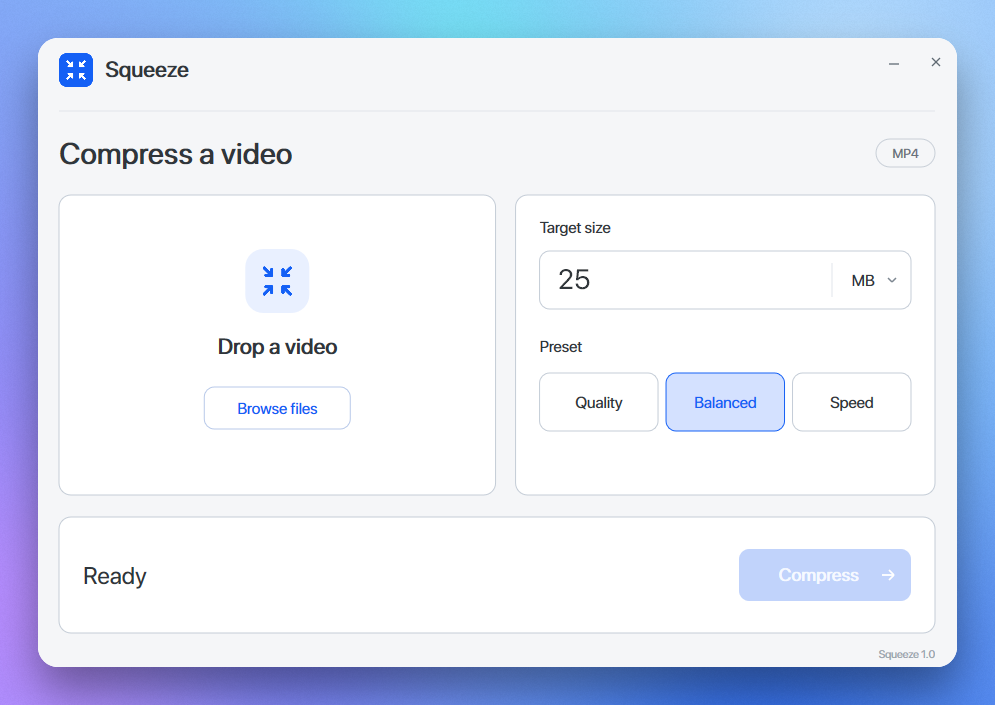

# Squeeze

A portable video compressor for Windows 10/11 (x64).

1. Drop a video or browse for a file.
2. Set a target size in MB or GB.
3. Choose Quality, Balanced, or Speed, then click Compress.

Keeps the original resolution and frame rate. Hardware encoding is selected automatically.

[Build instructions](docs/BUILD.md) · [MIT License](LICENSE) · [Third-party licenses](third_party/README.md)
